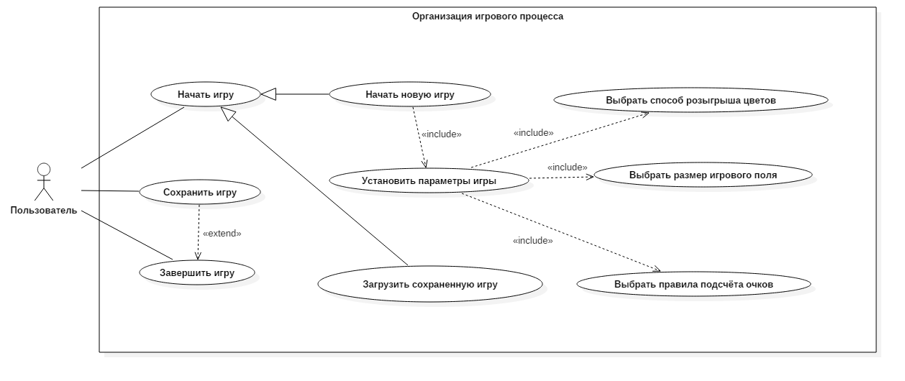

# Go

## Задание
  Разработать приложение для игры Го.

## Концепция
  Готовый продукт является кроссплатформенным и содержит как приложение консольное, так и с графическим интерфесом. Есть искусственный
  интеллект (ИИ), который обладает простой логикой, а не случайно ходит в свободный пункт. Имеется возможность выбрать правила игры:
  японские или китайские. Определенный правилами размер игровой доски 19х19 пунктов можно изменить на 13х13 и 7х7. Наличие ИИ
  позволяет не только играть двоим игрокам друг против друга, но и играть одному игроку против ИИ. Выбор цвета камней происходит либо 
  по договоренности (в случае игры против ИИ цвет выбирает пользователь), либо случайно, либо в соответствии с традиционной процедурой
  __нигири__. Ход событий текущей партии можно сохранить и в дальнейшем загрузить и продолжить. 
  
  Разработка сопровождается модульным и функциональным тестированием на всех этапах.

## Правила игры

### Основная часть
  * Го представляет собой доску размера 19х19 пунктов (пересечений прямых линий) и камни двух цветов: чёрные и белые. В Го
  задействованы 2 игрока, один из которых играет чёрными камнями, а другой - белыми. Распределение игровых цветов между соперниками
  происходит в соответствии с процедурой __нигири__. Затем игроки до завершения игры поочерёдно делают ходы. Правом первого хода обладает
  игрок, которому достались чёрные камни. Засчёт этого белым дается компенсация ввиде _коми_ - определённого числа очков преимущества.
  * Ход заключается в том, что игрок устанавливает камень своего цвета в любой свободный пункт на доске, если это не противоречит двум правилам:
    1. Устанавливаемый камень должен иметь хотя бы одно __дыхание__. __Дыханием__ называется свободный соседний пункт, соединенный с       данным камнем по прямой линии. Ход может быть осуществлен так, что устанавливаемый камень лишает свою группу дыхания, но при этом
    лишает дыхания группу соперника, тем самым __захватывая__ ее в __плен__.

    2.Данный ход игрока не повторяет его предыдущий ход.
    или пассует (пропускает ход).
  * _Захват в плен_ группы камней (или одного камня) соперника считается осуществлённым, если эта группа камней не имеет
    ни одного __дыхания__, то есть ни один камень группы не имеет __дыханий__. __Захваченные__ камни снимаются с доски и остаются до
    конца игры у их "захватчика".
  * Цель игроков - к концу игры набрать больше очков, чем соперник.
  * Игры завершается в трёх случаях:
    1. Один из игроков сдается.
    2. В ответ на пропуск хода одним игроком следует пропуск хода другим.
    3. Не осталось ходов, способных повлиять на ситуацию на доске.

### Особенности японских правил

### Особенности китайских правил

## Минимально работоспособный продукт
 Кроссплатформеное консольное приложение, позволяющее в соответствии с японскими правилами играть двоим игрокам.
 
## Диаграммы вариантов использования

## Диаграмма последовательностей
В процессе разработки
## Диаграмма компонентов

